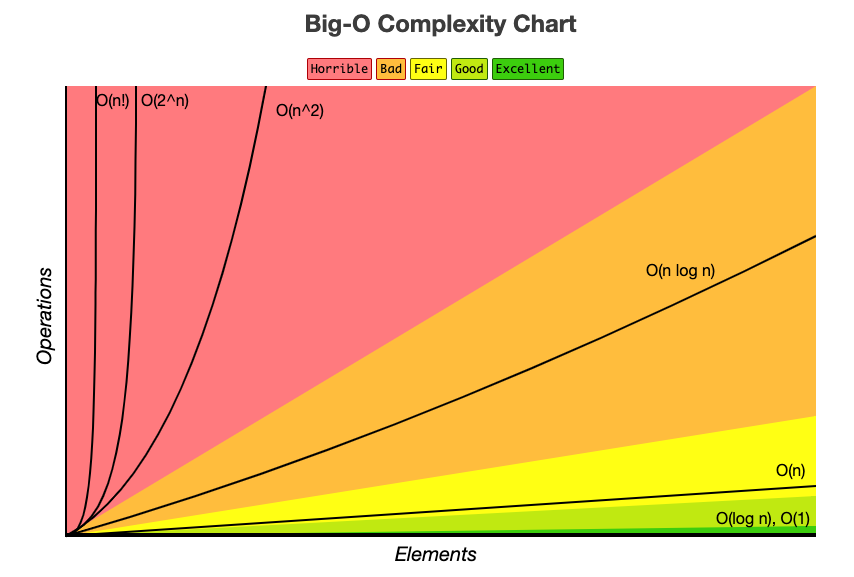

# Algolithm
    시간 복잡도(Time Complexity)	
        - 알고리즘이 실행될 때 필요한 "입력 값","연산 수행 시간" 에 따라 효율적인 알고리즘을 나타내는 척도를 의미
        - 입력 값이 커질수록 알고리즘의 수행 시간이 어떻게 증가하는지에 따른 지표를 의미
        - 시간 복잡도는 ‘빅오 표기법(Big-O notation)’를 통해 표현 , 작을수록 효율적 의미

    공간 복잡도(Space Complexity)
        - 알고리즘이 실행될 때 필요한 메모리 리소스 
        - 알고리즘의 효율성을 판단에 사용, 일반적으로 메모리 사용량이 적을수록 더 효율적인 알고리즘

    공간 복잡도는 일반적으로 알고리즘의 시간 복잡도와 함께 고려
    알고리즘이 실행되는 환경에 따라 다름 
    알고리즘을 설계할때에는 시간 복잡도와 공간 복잡도를 함께 고려
    
    빅오 표기법(Big-O notation)
    - 알고리즘의 입력 크기에 대해 수행 시간을 표기하는 것, 최악의 경우의 시간 복잡도를 의미
    - 알고리즘이 입력 크기에 따라 가장 오래 걸리는 경우를 의미합니다.
    - 이를 분석함으로써 알고리즘을 설계할 때 최악의 성능을 예측하고 최악의 경우에도 어느 정도의 실행 속도를 보장함을 확인합니다.

    
    브루트 포스
    정렬
    재귀	
    백트래킹
    DP
    그리디